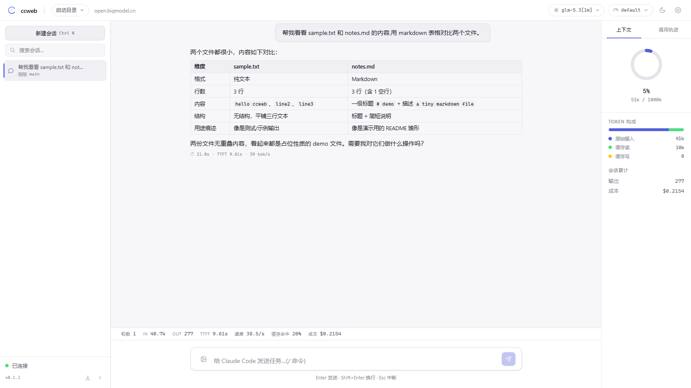
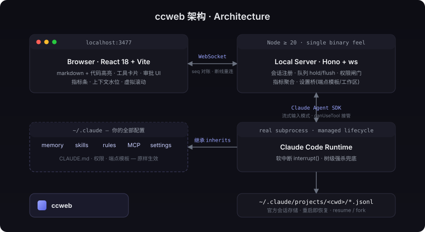
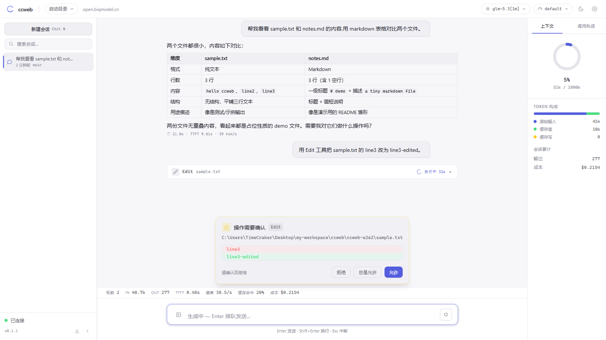
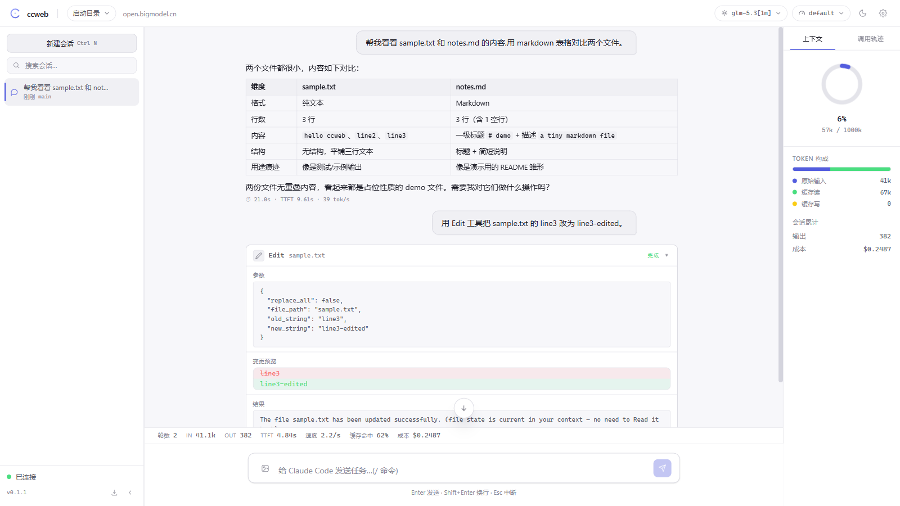
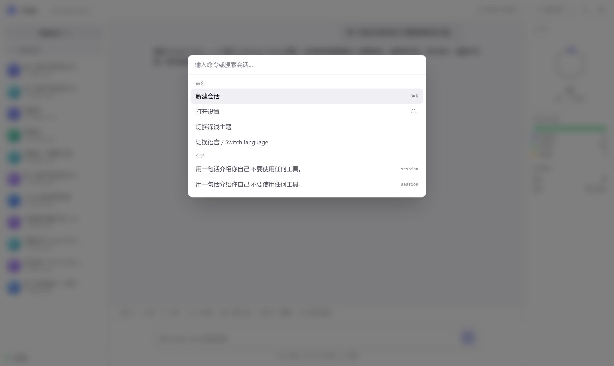
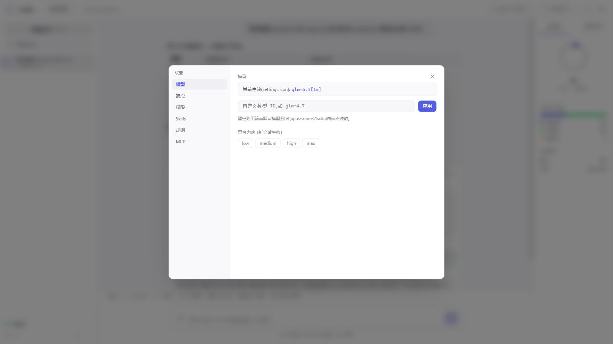
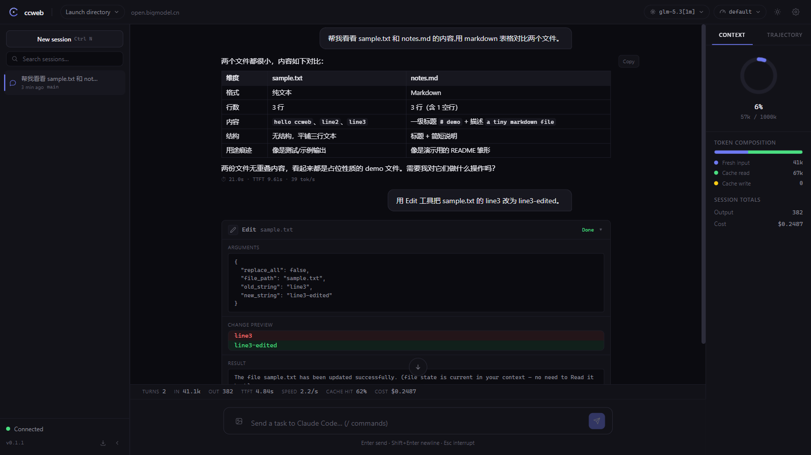

<div align="center">

# ccweb

**Professional local web console for Claude Code**

跑的是**真 Claude Code runtime** —— 你的 `~/.claude` 全套配置(memory / skills / rules / MCP)原样生效。

[](https://www.npmjs.com/package/ccweb-console)
[](#license)
[](#快速开始)

`npx ccweb-console` → 打开 `http://127.0.0.1:3477`,就这么简单。



</div>

---

## 它解决什么问题

终端里的 Claude Code 很强,但长会话缺一层**图形化的管理与观测**。ccweb 基于官方 **Claude Agent SDK** 驱动真正的 Claude Code 子进程,把这一层补齐——不是模拟,不是代理,是给真 runtime 装上仪表盘。

## 功能总览

| | 功能 | 说明 |
|---|---|---|
| 💬 | **完整对话 GUI** | markdown + 代码高亮、thinking 折叠、消息分叉(fork)、重新生成 |
| 🔧 | **工具调用卡片** | Read/Grep 行号展示、Edit 行级 diff 预览(红删绿增)、Bash 输出 ANSI 着色、耗时统计 |
| 🛡 | **可视化审批** | 高危操作确认卡、总是允许(会话级)、AskUserQuestion 接管为选项卡 UI |
| 📬 | **消息队列** | 生成中发送自动排队:可见、可撤销、turn 结束自动 flush |
| 📊 | **实时指标条** | 轮数 / TTFT / tokens/s / 缓存命中率 / 成本(口径以 SDK `result.modelUsage` 为权威,零估算) |
| 🧭 | **上下文水位** | 环形图 + Token 构成三色条,高水位(>85%)主动警示 |
| 🧭 | **调用轨迹视图** | 右栏时间线:每次工具调用的状态点、摘要、耗时 |
| 🗂 | **会话管理** | 搜索 / resume / fork / 改名 / 删除 / 拖拽排序(本地持久化)/ 历史回放 |
| 📎 | **图片附件** | 粘贴 / 拖放 / 选择,Lightbox 全屏放大 |
| ⌨️ | **补全** | `/` 斜杠命令(含你的自定义 skills)、`@` 工作区文件路径 |
| ⚙️ | **全图形设置** | 模型热切换、effort、权限模式、API 端点模板(凭证不出本地)、Skills / Rules / CLAUDE.md 查看 |
| 🌓 | **深浅双主题 · 中英双语 UI** | 断线自动重连对账(seq 重放,不丢消息) |
| 💾 | **一键导出 Markdown** | 完整对话含工具调用 |

## 架构



- **软中断 / 多轮常驻**依赖 SDK 流式输入模式(`interrupt()` 仅此模式可用);进程退出用树级强杀兜底(Windows `taskkill /T /F`)
- 指标全部来自 SDK 原生字段(`ttft_ms` / `modelUsage` / `total_cost_usd`)
- 会话历史走官方 `listSessions()` / `getSessionMessages()`,server 重启天然恢复

## 快速开始

```bash
# 需要 Node.js 20+;SDK 自带 claude 二进制,无需单独安装 Claude Code CLI
npx ccweb-console
```

浏览器打开 `http://127.0.0.1:3477`。API 端点沿用你环境里的 `ANTHROPIC_BASE_URL` / `ANTHROPIC_AUTH_TOKEN`(或在设置页切换已配置的端点模板)。

<details>
<summary>从源码运行</summary>

```bash
git clone https://github.com/TimeCraker/ccweb && cd ccweb
pnpm install && pnpm build && node apps/server/bin/ccweb.mjs
```
</details>

## 键盘快捷键

| 按键 | 动作 |
|---|---|
| `Ctrl+K` | 命令面板(命令 / 会话 / 工作区) |
| `Ctrl+N` | 新建会话 |
| `Ctrl+B` | 折叠侧栏 |
| `Ctrl+,` | 打开设置 |
| `Esc` | 中断生成 / 关闭弹层 |
| `Enter` / `Shift+Enter` | 发送 / 换行(生成中 Enter = 排队) |
| `/` `@` | 斜杠命令 / 文件路径补全 |

## Screenshots

| | |
|---|---|
|  |  |
| Edit 审批:行级 diff 预览 + 允许/拒绝/总是允许 | Read 工具卡:参数 + 带行号结果 |
|  |  |
| Ctrl+K:命令、工作区一站式 | 模型 / 端点 / 权限 / Skills / MCP |

<details>
<summary>更多截图</summary>

| | |
|---|---|
|  |  |
| Light 主题 | English UI |
</details>

## Troubleshooting

- **会话列表为空**:确认工作区(页脚「启动目录」)是你实际跑会话的目录;Windows 下路径已自动归一化
- **端口冲突**:`CCWEB_PORT=3999 npx ccweb-console`
- **切换端点模板后不生效**:端点设置对新会话生效,当前会话沿用启动时环境

## Development

```bash
pnpm install
pnpm dev        # 并行起 server(3477) + web(5173, WS 代理)
pnpm check      # lint + typecheck + test + build 质量门
```

---

## English

**ccweb** is a professional, open-source web console for Claude Code — built on the official **Claude Agent SDK**, it drives a real Claude Code runtime behind a full GUI. Your entire `~/.claude` setup (memory / skills / rules / MCP) applies automatically.

```bash
npx ccweb-console   # Node 20+; bundles its own claude binary
```

Open `http://127.0.0.1:3477`. Endpoint credentials come from your environment (`ANTHROPIC_BASE_URL` / `ANTHROPIC_AUTH_TOKEN`) or any configured template in Settings.

### Highlights

- 🖥 **Full GUI** — markdown + syntax highlighting, tool-call cards (Read/Grep with line numbers, Edit with line-level diff preview, ANSI-colored Bash output), collapsible thinking, message fork & regenerate
- 🛡 **Visual approvals** — confirm dangerous actions in-app; AskUserQuestion rendered as tab UI; session-scoped "always allow"
- 📬 **Message queue** — messages sent while generating are queued, visible, cancelable, auto-flushed on turn end
- 📊 **Live metrics** — turns / TTFT / tokens-per-second / cache-hit rate / cost, sourced from SDK `result.modelUsage` (no estimates)
- 🧭 **Context gauge & trajectory** — usage ring with proactive warning above 85%; right-panel timeline of every tool call
- 🗂 **Session management** — search / resume / fork / rename / delete / drag-to-reorder; history replay survives server restarts
- ⌨️ **Completions** — `/` slash commands (including your custom skills) and `@` workspace file paths
- 🌓 Dark & light themes · bilingual UI (中文/English) · auto-reconnect with seq-based message reconciliation

### Architecture

Browser (React 18) ↔ WebSocket ↔ Local server (Node ≥20, Hono) ↔ Claude Agent SDK ↔ real Claude Code runtime, inheriting all of `~/.claude`. Sessions persist in the official `~/.claude/projects` store — restart-safe, resume & fork included.

## License

MIT © TimeCraker

> 本项目为社区第三方工具,与 Anthropic 无关联;Claude 为 Anthropic 商标。
> Community third-party tool; not affiliated with Anthropic. Claude is a trademark of Anthropic.
